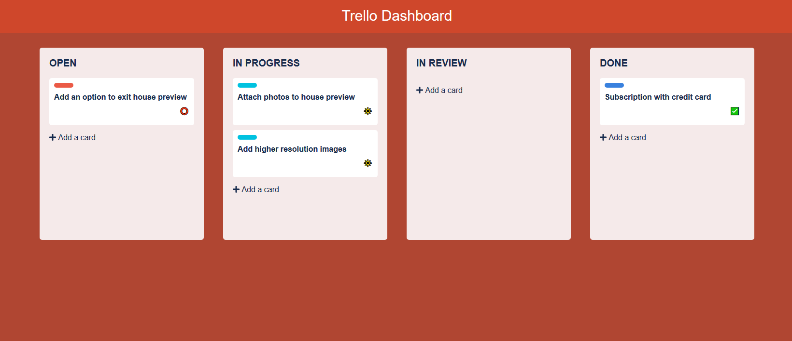
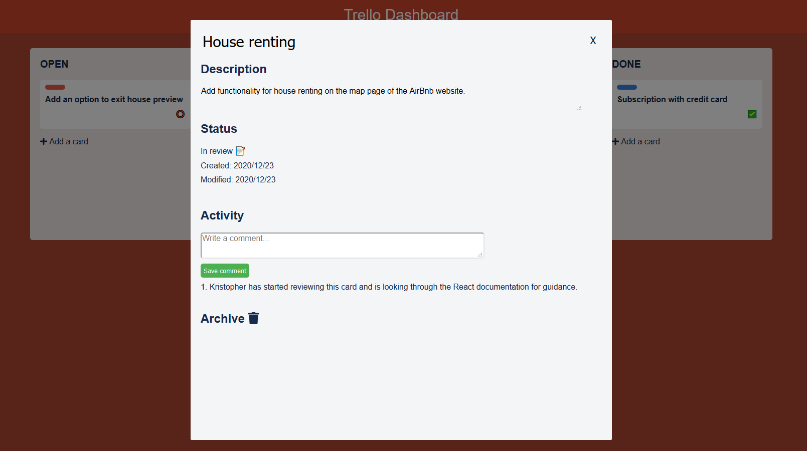

# trelloFamily

Trello Dashboard in ReactJS:
https://werlinder.netlify.app

## Installation

Use the cmd line to install dependencies.

```
npm install
```

## Usage

```
npm run build
npm run dev
localhost:4000 in the browser
```

## Preview




## Solves a babel/webpack issue

```
npm install -D babel-loader @babel/core @babel/preset-env webpack
```

Differences in production vs. development:
* In database/server.js change from: "./database/config/config.env" to "./config/config.env" before deploying.
* In client/src/pages/Homepage.jsx change from "localhost:3000" to "https://trello-family-backend.herokuapp.com/" before deploying.
* Btw. Pushing to this repository automatically deploys front and backend to Netlify and Heroku.
